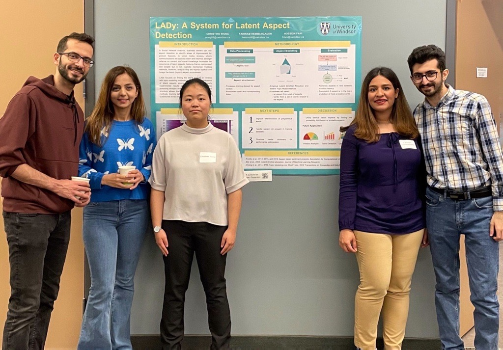

# `LADy`<sup>*</sup>: A System for Latent Aspect Detection
<sup>*Suggested by [Christine!](https://github.com/Lillliant)

`LADy` is an open-source platform that provides a standard and reproducible way of analyzing `unsolicited online reviews`. 
`LADy` is specifically focused on `Latent Aspect Detection` and is equipped with a wide range of `topic modeling` methods, `SemEval` training datasets, and `data augmentation` via `natural language back-translation`.
The latter helps to increase the size of the benchmark datasets using different interlanguages with English datasets.
Using `back-translation`, `LADy` could boost the performance of existing aspect detection methods like ***. 
`LADy` provides ideal platform for researchers, businesses, and individuals who want to gain insights into customer feedback and improve their products or services accordingly.

1. [Setup](#1-Setup)
2. [Quickstart](#2-Quickstart)
3. [Structure](#3-Structure)
4. [Experiment](#4-Experiment)
5. [License](#5-License)
6. [Awards](#6-Awards)

## 1. Setup
`LADy` has been developed on `Python 3.8` and can be installed by `conda` or `pip`:

```bash
git clone https://github.com/fani-lab/LADy.git
cd LADy
conda env create -f environment.yml
conda activate lady
```

```bash
git clone https://github.com/fani-lab/LADy.git
cd LADy
pip install -r requirements.txt
```
This command installs compatible versions of the following libraries:

> `./src/cmn`: `transformers, sentence_transformers, scipy, simalign, nltk`

> `./src/aml`: `gensim, nltk, pandas, requests, bitermplus`

> others: `pytrec-eval-terrier, sklearn, matplotlib, seaborn, tqdm`

Additionally, the following libraries should be installed:
> [`Microsoft C++ Build Tools`](https://visualstudio.microsoft.com/visual-cpp-build-tools/) as a requirement in ``btm``.

```bash
python -m spacy download en_core_web_sm
python -m nltk.downloader stopwords
python -m nltk.downloader punkt
```

## 2. [Quickstart](https://colab.research.google.com/drive/1aRkrnWpU43hqZvPRph59j8_dsHYHwinj?usp=sharing)
For quickstart purposes, a `toy` sample of reviews has been provided at [`./data/raw/semeval/toy.2016SB5/ABSA16_Restaurants_Train_SB1_v2.xml`](./data/raw/semeval/toy.2016SB5/ABSA16_Restaurants_Train_SB1_v2.xml).
You can run `LADy` by:
```bash
cd ./src
python main.py -naspects 5 -am rnd -data ./data/raw/semeval/toy.2016SB5/ABSA16_Restaurants_Train_SB1_v2.xml -output ./output/raw/semeval+/toy.2016SB5/ABSA16_Restaurants_Train_SB1_v2.xml/
```
This run will produce an output folder at [`./output/raw/semeval+/toy.2016SB5/ABSA16_Restaurants_Train_SB1_v2.xml/`](./output/raw/semeval+/toy.2016SB5/ABSA16_Restaurants_Train_SB1_v2.xml/) and a subfolder for `rnd` aspect modeling (random) baseline.
The final evaluation results are aggregated in [`./output/raw/semeval+/toy.2016SB5/ABSA16_Restaurants_Train_SB1_v2.xml/agg.pred.eval.mean.csv`](./output/raw/semeval+/toy.2016SB5/ABSA16_Restaurants_Train_SB1_v2.xml/agg.pred.eval.mean.csv). 

## 3. Structure
`LADy` has two layers: 

###[`./src/cmn`](./src/cmn)
Common layer (`cmn`) includes the abstract class definition for `Review`. 
Important attributes of `Review` are:

> `self.aos`: stores a list of `(aspect, opinion, sentiment)` triples for each sentence of a review, and 

> `self.augs`: stores the translated (`Review_`) and back-translated (`Review__`) versions of the original review along with the semantic similarity of back-translated version with original review in a dictionay `{'lang': (Review_, Review__, semantic score)}`

> `self.parent`: whether `self` is an original review or a translated or back-translated version.

This layer further includes `SemEvalReview`, which is a realization of `Review` class for reviews of `SemEval` datasets.
Specifically, this class overrides loading `SemEval`'s reviews into `Review` objects and stores it into a pickle file after preprocessing.
Pickle file is later used by models for training and testing purposes. Sample pickle files for a `toy` dataset: [`./output/semeval+/toy.2016SB5/ABSA16_Restaurants_Train_SB1_v2.xml`](./output/semeval+/toy.2016SB5/ABSA16_Restaurants_Train_SB1_v2.xml), there are some
where the filename `review.{list of languages}.pkl` shows the review objects also include back-translated versions in `{list of languages}`.

<p align="center"></p>

###[`./src/aml`](./src/aml)
Aspect model layer (`aml`) includes the abstract class definition `AbstractAspectModel` for aspect modeling methods. 
Important methods of are:

> `self.train(reviews_train, reviews_valid, ..., output)`: train the model on input training and validation samples and save the model in `output`,  

> `self.infer(review)`: infer (predict) the aspect of a given review, which is an ordered list of `self.naspect` aspects with different probability scores, like `[(0, 0.7), (1, 0.1), ...]`
To view the actual aspect terms (tokens), `self.get_aspect_words(aspect_id)` can be used which returns an ordered list of terms with probability scores like `[('food', 0.4),('sushi', 0.3), ...]`

> `self.load(path)`: loads a saved trained model.

This layer further includes realizations for different aspect modeling methods like, 

> [`Local LDA [Brody and Elhadad, NAACL2010]`](https://aclanthology.org/N10-1122/) in [`./src/aml/lda.py`](./src/aml/lda.py),

> [`Biterm Topic Modeling [WWW2013]`](https://dl.acm.org/doi/10.1145/2488388.2488514) in [`./src/aml/btm.py`](./src/aml/btm.py),

> [`Contextual Topic Modeling [EACL2021]`](https://aclanthology.org/2021.eacl-main.143/) in [`./src/aml/ctm.py`](./src/aml/ctm.py),

> [`Random`](./src/aml/rnd.py) in [`./src/aml/ctm.py`](./src/aml/rnd.py), which returns a shuffled list of tokens as a prediction for aspects of a review to provide a minimum baseline for comparison.

Sample models trained on a `toy` dataset can be found [`./output/semeval+/toy.2016SB5/ABSA16_Restaurants_Train_SB1_v2.xml/{model name}`](./output/semeval+/toy.2016SB5/ABSA16_Restaurants_Train_SB1_v2.xml).

<p align="center"></p>

###[`./src/main.py`](./src/main.py)
`LADy`'s driver code accepts the following args:

> `-naspects`: the number of possible aspects for a review in a domain, e.g., `-naspect 5`, like in `restaurant` we may have 5 aspects including `['food', 'staff', ...]`

> `-am`: the aspect modeling (detection) method, e.g., `-am lda`, including `rnd`, `lda`,`btm`, `ctm`, `nrl`

> `-data`: the raw review file, e.g., `-data ../data/raw/semeval/toy.2016SB5/ABSA16_Restaurants_Train_SB1_v2.xml`

> `-output`: the folder to store the pipeline outputs, e.g., `-output ../output/semeval+/toy.2016SB5/ABSA16_Restaurants_Train_SB1_v2.xml` including preprocessed reviews, trained models, predictions, evaluations, ...

`LADy` knows the methods' hyperparameters and evaluation settings from [`./src/param.py`](./src/param.py)

Here is the codebase folder structure:
```
├── src
|   ├── cmn
|   |   ├── review.py   -> class definition for review as object
|   |   ├── semeval.py  -> overriden class for semeval reviews
|   ├── aml
|   |   ├── mdl.py      -> abstract aspect model to be overriden by baselines
|   |   ├── rnd.py      -> random aspect model that randomly predicts aspects
|   |   ├── lda.py      -> unsupervised aspect detection based on LDA
|   |   ├── btm.py      -> unsupervised aspect detection based on biterm topic modeling
|   |   ├── ctm.py      -> unsupervised aspect detection based on contextual topic modeling
|   |   ├── nrl.py      -> 
|   ├── param.py        -> running settings of the pipeline
|   ├── main.py         -> main driver of the pipeline
```

### `-output {output}`
`LADy` runs the pipleline for `['prep', 'train', 'test', 'eval', 'agg']` steps and generate outputs in the given `-output` path:

> `['prep']`: loads raw reviews and generate review objects in `{output}/review.{list of languages}.pkl` like [`./output/semeval+/toy.2016SB5/ABSA16_Restaurants_Train_SB1_v2.xml/`](./output/semeval+/toy.2016SB5/ABSA16_Restaurants_Train_SB1_v2.xml/)
 
> `['train']`: loads review objects and create an instance of aspect modeling (detection) method given in `-am {am}`. 
> `LADy` splits reviews into `train` and `test` based on `params.settings['train']['ratio']` in [`./src/params.py`](./src/params.py).
> `LADy` further splits `train` into `params.settings['train']['nfolds']` for cross-validation and model tuning during training. 
> The results of this step is a collection trained models for each fold in `{output}/{am}/` like [`./output/semeval+/toy.2016SB5/ABSA16_Restaurants_Train_SB1_v2.xml/lda/`](./output/semeval+/toy.2016SB5/ABSA16_Restaurants_Train_SB1_v2.xml/lda/)
```
├── f{k}.model            -> saved aspect model for k-th fold
├── f{k}.model.dict       -> dictionary of tokens/words for k-th fold
```

> `['test']`: 

> `['eval']`: 
 
> `['agg']`: 

## 4. Experiment
Due to OOV (an aspect might be in test set which is not seen in traning set during model training), we may have metric@n for n >> +inf not equal to 1.

## 5. License
©2021. This work is licensed under a [CC BY-NC-SA 4.0](LICENSE.txt) license.

### Authors
Farinam Hemmatizadeh <sup>1,2</sup>, Chritine Wong<sup>1</sup>, [Hossein Fani](https://hosseinfani.github.io/)<sup>1,3</sup>

<sup><sup>1</sup>School of Computer Science, Faculty of Science, University of Windsor, ON, Canada.</sup>

<sup><sup>2</sup>[hemmatif@uwindsor.ca](mailto:hemmatif@uwindsor.ca), [f.hemmatizadeh@gmail.com](mailto:f.hemmatizadeh@gmail.com)</sup>
<sup><sup>3</sup>[hfani@uwindsor.ca](mailto:hfani@uwindsor.ca)</sup>

### Contributing
Pull requests are highly encouraged and welcomed. However, for significant modifications, please initiate a discussion by opening an issue beforehand to clarify what modifications you intend to make.

### Acknowledgments
In this work, we use [`LDA`](https://radimrehurek.com/gensim/models/ldamodel.html), [`bitermplus`](https://github.com/maximtrp/bitermplus), [`pytrec_eval`](https://github.com/cvangysel/pytrec_eval), [`SimAlign`](https://github.com/cisnlp/simalign), [`DeCLUTR`](https://github.com/JohnGiorgi/DeCLUTR), [`No Language Left Behind (NLLB)`](https://github.com/facebookresearch/fairseq/tree/nllb), and other libraries and models. We would like to thank the authors of these works.

## 7. Awards

> [`CAD$150, Silver Medalist, UWill Discover 2023`](https://symposium.foragerone.com/uwill-discover-sustainable-futures/presentations/51413)
> 👉 [`slides`](./misc/UWillDiscover23.pdf)
> <p align="center"></p>
