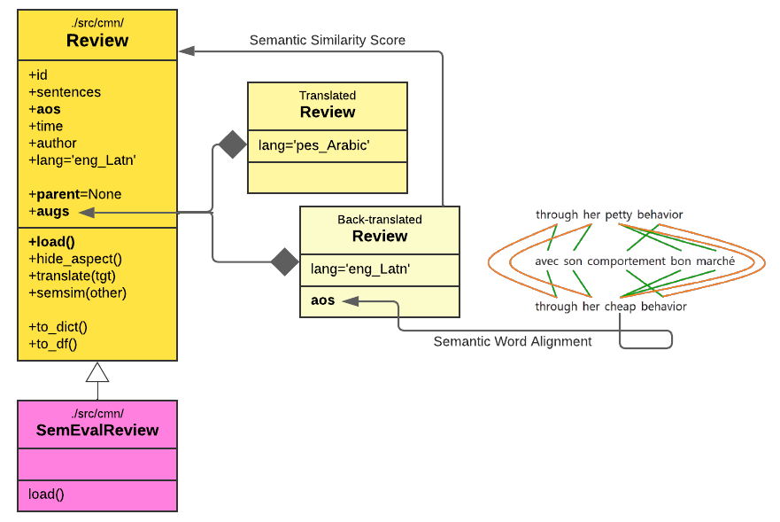

# 💃 `LADy`<sup>*</sup>: A System for Latent Aspect Detection
<sup>*Suggested by [Christine!](https://github.com/Lillliant)


`LADy` is a `python-based` framework to facilitate research in `aspect detection`, which involves extracting `aspects` of products or services in reviews toward which customers target their opinions and sentiments. Aspects could be explicitly mentioned in reviews or be `latent` due to social background knowledge. With a special focus on `latent aspect detection `, `LADy` hosts various canonical aspect detection methods and benchmark datasets of unsolicited reviews from `semeval` and `google reviews`.
`LADy`'s object-oriented design allows for easy integration of new `methods`, `datasets`, and `evaluation metrics`. Notably, `LADy` features review `augmentation` via `natural language backtranslation` that can be seamlessly integrated into the training phase of the models to boost `efficiency` and improve `efficacy` during inference.

<table align="center" border=0>
<tr>
<td >

- [1. Setup](#1-setup)
- [2. Quickstart](#2-quickstart)
- [3. Structure](#3-structure)
- [4. Experiment](#4-experiment)
- [5. License](#5-license)
- [6. Acknowledgments](#6-acknowledgments)
- [7. Awards](#7-awards)
- [8. Contributing](#8-contributing)

</td>
<td>
  <p align="center">
 
<!--  <br> -->
<!--  <a href="https://lucid.app/lucidchart/fe256064-3fda-465a-9abc-036dfc40acad/edit?view_items=svRVuxyZvY9n%2CsvRVVLD91NpJ%2CxDRV-pti53Ae%2CwJRVh7la6C-y%2CBLRV4aXmE.uY%2CBLRVOyM~DMFW&invitationId=inv_6e8aa9a6-1854-4ecf-a753-e1b2e05b50fc">class diagram for review</a> -->
</p>
</td>
</tr>
</table>


## 1. Setup
`LADy` has been developed on `Python 3.8` and can be installed by `conda` or `pip`:

```bash
git clone --recursive https://github.com/fani-lab/LADy.git
cd LADy
conda env create -f environment.yml
conda activate lady
```

```bash
git clone --recursive https://github.com/fani-lab/LADy.git
cd LADy
pip install -r requirements.txt
```
This command installs compatible versions of the following libraries:

> [`./src/cmn`](./src/cmn): `transformers, sentence_transformers, scipy, simalign, nltk`

> [`./src/aml`](./src/aml): `gensim, nltk, pandas, requests, bitermplus, contextualized_topic_models`

> others: `pytrec-eval-terrier, sklearn, matplotlib, seaborn, tqdm`

The following aspect detection baselines will be also cloned as submodules:
> [`bert-e2e-absa`](https://aclanthology.org/D19-5505/) → [`./src/bert-e2e-absa`](https://github.com/fani-lab/BERT-E2E-ABSA)

> [`hast`](https://www.ijcai.org/proceedings/2018/0583) → [`./src/hast`](https://github.com/fani-lab/HAST)

> [`cat`](https://aclanthology.org/2020.acl-main.290/) → [`./src/cat`](https://github.com/fani-lab/cat)

Additionally, the following libraries should be installed:
> [`Microsoft C++ Build Tools`](https://visualstudio.microsoft.com/visual-cpp-build-tools/) as a requirement of biterm topic modeling in [`./src/btm.py`](./src/btm.py).

```bash
python -m spacy download en_core_web_sm
python -m nltk.downloader stopwords
python -m nltk.downloader punkt
```

Further, we reused [`octis`](https://aclanthology.org/2021.eacl-demos.31.pdf) as submodule [`./src/octis`](https://github.com/fani-lab/OCTIS) for `unsupervised` neural aspect modeling using e.g., [`neural lda`](https://arxiv.org/pdf/1703.01488.pdf):

```bash
cd src/octis
python setup.py install
```

## 2. Quickstart[](https://colab.research.google.com/github/fani-lab/LADy/blob/main/quickstart.ipynb)
For quickstart purposes, a `toy` sample of reviews has been provided at [`./data/raw/semeval/toy.2016SB5/ABSA16_Restaurants_Train_SB1_v2.xml`](./data/raw/semeval/toy.2016SB5/ABSA16_Restaurants_Train_SB1_v2.xml).
You can run `LADy` by:
```bash
cd ./src
python main.py -naspects 5 -am rnd -data ../data/raw/semeval/toy.2016SB5/ABSA16_Restaurants_Train_SB1_v2.xml -output ../output/toy.2016SB5/
```
This run will produce an output folder at [`../output/toy.2016SB5/`](./output/toy.2016SB5/) and a subfolder for `rnd` aspect modeling (random) baseline.
The final evaluation results are aggregated in [`../output/toy.2016SB5/agg.pred.eval.mean.csv`](./output/toy.2016SB5/agg.pred.eval.mean.csv). 

## 3. Structure
`LADy` has two layers: 

### [`./src/cmn`](./src/cmn)
Common layer (`cmn`) includes the abstract class definition for `Review`. 
Important attributes of `Review` are:

> `self.aos`: stores a list of `(aspect, opinion, sentiment)` triples for each sentence of a review, and 

> `self.augs`: stores the translated (`Review_`) and back-translated (`Review__`) versions of the original review along with the semantic similarity of back-translated version with original review in a dictionay `{'lang': (Review_, Review__, semantic score)}`

> `self.parent`: whether `self` is an original review or a translated or back-translated version.

This layer further includes `SemEvalReview`, which is a realization of `Review` class for reviews of `SemEval` datasets.
Specifically, this class overrides loading `SemEval`'s reviews into `Review` objects and stores it into a pickle file after preprocessing.
Pickle file is later used by models for training and testing purposes. Sample pickle files for a `toy` dataset: [`./output/toy.2016SB5/ABSA16_Restaurants_Train_SB1_v2.xml`](./output/toy.2016SB5/ABSA16_Restaurants_Train_SB1_v2.xml), there are some
where the filename `review.{list of languages}.pkl` shows the review objects also include back-translated versions in `{list of languages}`.

<p align="center">
 
 <br>
 <a href="https://lucid.app/lucidchart/fe256064-3fda-465a-9abc-036dfc40acad/edit?view_items=svRVuxyZvY9n%2CsvRVVLD91NpJ%2CxDRV-pti53Ae%2CwJRVh7la6C-y%2CBLRV4aXmE.uY%2CBLRVOyM~DMFW&invitationId=inv_6e8aa9a6-1854-4ecf-a753-e1b2e05b50fc">class diagram for review</a>
</p>

### [`./src/aml`](./src/aml)
Aspect model layer (`aml`) includes the abstract class definition `AbstractAspectModel` for aspect modeling methods. 
Important methods of are:

> `self.train(reviews_train, reviews_valid, ..., output)`: train the model on input training and validation samples and save the model in `output`,  

> `self.infer(review)`: infer (predict) the aspect of a given review, which is an ordered list of `self.naspect` aspects with different probability scores, like `[(0, 0.7), (1, 0.1), ...]`
To view the actual aspect terms (tokens), `self.get_aspect_words(aspect_id)` can be used which returns an ordered list of terms with probability scores like `[('food', 0.4),('sushi', 0.3), ...]`

> `self.load(path)`: loads a saved trained model.

This layer further includes realizations for different aspect modeling methods like, 

> [`Local LDA [Brody and Elhadad, NAACL2010]`](https://aclanthology.org/N10-1122/) in [`./src/aml/lda.py`](./src/aml/lda.py),

> [`Biterm Topic Modeling [WWW2013]`](https://dl.acm.org/doi/10.1145/2488388.2488514) in [`./src/aml/btm.py`](./src/aml/btm.py),

> [`Contextual Topic Modeling [EACL2021]`](https://aclanthology.org/2021.eacl-main.143/) in [`./src/aml/ctm.py`](./src/aml/ctm.py),

> [`BERT-E2E-ABSA [W-NUT@EMNLP2019]`](https://aclanthology.org/D19-5505/) in [`./src/bert-e2e-absa`](https://github.com/fani-lab/BERT-E2E-ABSA)
 
> [`HAST [IJCAI2018]`](https://aclanthology.org/2021.eacl-main.143/) in [`./src/hast`](https://github.com/fani-lab/HAST)
 
> [`CAt [ACL2020]`](https://aclanthology.org/2020.acl-main.290/) in [`./src/cat`](https://github.com/fani-lab/cat),

> [`Random`](./src/aml/rnd.py) in [`./src/aml/ctm.py`](./src/aml/rnd.py), which returns a shuffled list of tokens as a prediction for aspects of a review to provide a minimum baseline for comparison.

Sample models trained on a `toy` dataset can be found [`./output/toy.2016SB5//{model name}`](./output/toy.2016SB5/).

<p align="center">
 <br>
  <a href="https://lucid.app/lucidchart/fe256064-3fda-465a-9abc-036dfc40acad/edit?view_items=svRVuxyZvY9n%2CsvRVVLD91NpJ%2CxDRV-pti53Ae%2CwJRVh7la6C-y%2CBLRV4aXmE.uY%2CBLRVOyM~DMFW&invitationId=inv_6e8aa9a6-1854-4ecf-a753-e1b2e05b50fc">class diagram for aspect modeling hierarchy</a>
</p>

### [`./src/main.py`](./src/main.py)
`LADy`'s driver code accepts the following args:

> `-naspects`: the number of possible aspects for a review in a domain, e.g., `-naspect 5`, like in `restaurant` we may have 5 aspects including `['food', 'staff', ...]`

> `-am`: the aspect modeling (detection) method, e.g., `-am lda`, including `rnd`, `lda`,`btm`, `ctm`, `nrl`, `bert`, `hast`, `cat`

> `-data`: the raw review file, e.g., `-data ../data/raw/semeval/toy.2016SB5/ABSA16_Restaurants_Train_SB1_v2.xml`

> `-output`: the folder to store the pipeline outputs, e.g., `-output ../output/toy.2016SB5/ABSA16_Restaurants_Train_SB1_v2.xml` including preprocessed reviews, trained models, predictions, evaluations, ...

`LADy` knows the methods' hyperparameters and evaluation settings from [`./src/params.py`](./src/params.py)

Here is the codebase folder structure:
```
├── src
|   ├── cmn
|   |   ├── review.py   -> class definition for review as object
|   |   ├── semeval.py  -> overridden class for semeval reviews
|   ├── aml
|   |   ├── mdl.py      -> abstract aspect model to be overridden by baselines
|   |   ├── rnd.py      -> random aspect model that randomly predicts aspects
|   |   ├── lda.py      -> unsupervised aspect detection based on LDA
|   |   ├── btm.py      -> unsupervised aspect detection based on biterm topic modeling
|   |   ├── ctm.py      -> unsupervised aspect detection based on contextual topic modeling (neural)
|   |   ├── nrl.py      -> unsupervised aspect detection based on neural topic modeling
|   ├── params.py       -> running settings of the pipeline
|   ├── main.py         -> main driver of the pipeline
```

### `-output {output}`
`LADy` runs the pipleline for `['prep', 'train', 'test', 'eval', 'agg']` steps and generates outputs in the given `-output` path:

> `['prep']`: loads raw reviews and generate review objects in `{output}/review.{list of languages}.pkl` like [`./output/toy.2016SB5/`](./output/toy.2016SB5/)
 
> `['train']`: loads review objects and create an instance of aspect modeling (detection) method given in `-am {am}`. 
> `LADy` splits reviews into `train` and `test` based on `params.settings['train']['ratio']` in [`./src/params.py`](./src/params.py).
> `LADy` further splits `train` into `params.settings['train']['nfolds']` for cross-validation and model tuning during training. 
> The result of this step is a collection of trained models for each fold in `{output}/{naspect}.{languges used for back-translation}/{am}/` like [`./output/toy.2016SB5/5.arb_Arab/lda`](./output/toy.2016SB5/5.arb_Arab/lda/)
```
├── f{k}.model            -> saved aspect model for k-th fold
├── f{k}.model.dict       -> dictionary of tokens/words for k-th fold
```

> `['test']`: predicts the aspects on the test set with `params.settings["test"]["h_ratio"] * 100` % latent aspect meaning that this percentage of the aspects will be hidden in the test reviews.
Also, the model will which has been saved in the previous step (train) will be loaded to be used for inference.
> The results of inference will be pairs of golden truth aspects with the inferred aspects sorted based on their probability that will be saved for each fold in `{output}/{naspect}/{am}/` like [`./output/toy.2016SB5/5/lda`](./output/toy.2016SB5/5/lda/)
```
├── f{k}.model.pred.{h_ratio}        -> pairs of golden truth and inferred aspects with (h_ratio * 100) % hidden aspects for k-th fold
```

> `['eval']`: evaluate the inference results in the test step and save the results for different metrics in [`params.settings['eval']['metrics']`](https://github.com/fani-lab/LADy/blob/main/src/params.py#L55) for different k in `params.settings["eval"]["topkstr"]`.
> The result of this step will be saved for each fold in `{output}/{naspect}/{am}/` like [`./output/toy.2016SB5/5/lda`](./output/toy.2016SB5/5/lda/)
```
├── f{k}.model.pred.{h_ratio}       -> evaluation of inference for k-th fold with (h_ratio * 100) % hidden aspects
├── model.pred.{h_ratio}.csv        -> mean of evaluation for all folds with (h_ratio * 100) % hidden aspects
```
 
> `['agg']`: aggregate the inferred result in this step for all the aspect models in all the folds and for all the `h_ratio` values will be saved in a file in `{output}/` like [`./output/toy.2016SB`](./output/toy.2016SB5)

```
├── agg.pred.eval.mean.csv          -> aggregated file including all inferences on a specific dataset
```

## 4. Experiment

We conducted a series of experiments involving backtranslation using `six` different `natural languages` that belong to `diverse language families`. These experiments aimed to explore the effect of `backtranslation augmentation` across various aspect detection methods and domains, particularly in the context of `restaurant` and `laptop` `reviews`, where aspects may not necessarily be explicitly mentioned but are implicitly present with no surface form (`latent`). Through our findings, we observed a synergistic impact, indicating that the utilization of `backtranslation` enhances the performance of `aspect detection` whether the aspect is 'explicit' or 'latent'.

### Datasets

`LADy` utilizes state-of-the-art `semeval` datasets to `augment` the english datasets with `backtranslation` via different languages and evaluate `latent aspect detection`. Specifically, training sets from `semeval-14` for restaurant and laptop reviews, as well as restaurant reviews from `semeval-15` and `semeval-16` are employed. Moreover, we have created a compact and simplified version of the original datasets, referred to as a `toy dataset`, for our experimental purposes.

| dataset               | file (.xml)                                                                                                                                                                          |
|-----------------------|--------------------------------------------------------------------------------------------------------------------------------------------------------------------------------------|
| semeval-14-laptop     | [`./data/raw/semeval/SemEval-14/Laptop_Train_v2.xml`](./data/raw/semeval/SemEval-14/Laptop_Train_v2.xml)                                                                             |
| semeval-14-restaurant | [`./data/raw/semeval/SemEval-14/Semeval-14-Restaurants_Train.xml`](./data/raw/semeval/SemEval-14/Semeval-14-Restaurants_Train.xml)                                                   |
| semeval-15-restaurant | [`./data/raw/semeval/2015SB12/ABSA15_RestaurantsTrain/ABSA-15_Restaurants_Train_Final.xml`](./data/raw/semeval/2015SB12/ABSA15_RestaurantsTrain/ABSA-15_Restaurants_Train_Final.xml) |
| semeval-16-restaurant | [`./data/raw/semeval/2016SB5/ABSA16_Restaurants_Train_SB1_v2.xml`](./data/raw/semeval/2016SB5/ABSA16_Restaurants_Train_SB1_v2.xml)                                                   |
| toy                   | [`./data/raw/semeval/toy.2016SB5/ABSA16_Restaurants_Train_SB1_v2.xml`](./data/raw/semeval/toy.2016SB5/ABSA16_Restaurants_Train_SB1_v2.xml)                                           |

### Statistics on original and backtranslated reviews

The reviews were divided into sentences, and our experiments were conducted on each sentence treated as an individual review, assuming that each sentence represents a single aspect. The statistics of the datasets can be seen in the table below.

|                       |                              |              | exact match |        |        |        |        |         |
|-----------------------|------------------------------|--------------|-------------|--------|--------|--------|--------|---------|
| dataset               | #reviews  | avg #aspects | chinese  | farsi  | arabic | french | german | spanish |
| semeval-14-laptop     | 1,488     | 1.5846       | 0.1763   | 0.2178 | 0.2727 | 0.3309 | 0.3214 | 0.3702  |
| semeval-14-restaurant | 2,023     | 1.8284       | 0.1831   | 0.2236 | 0.2929 | 0.3645 | 0.3724 | 0.4088  |
| semeval-15-restaurant | 0,833     | 1.5354       | 0.2034   | 0.2312 | 0.3021 | 0.3587 | 0.3907 | 0.4128  |
| semeval-16-restaurant | 1,234     | 1.5235       | 0.2023   | 0.2331 | 0.2991 | 0.3556 | 0.3834 | 0.4034  |

### Results

The average performance of 5-fold models with backtranslation is provided in the table below:

<table class="tg">
<thead>
  <tr>
    <th class="tg-uzvj"></th>
    <th class="tg-uzvj"></th>
    <th class="tg-uzvj">bert-tfm</th>
    <th class="tg-uzvj"></th>
    <th class="tg-uzvj"></th>
    <th class="tg-uzvj">cat</th>
    <th class="tg-uzvj"></th>
    <th class="tg-uzvj"></th>
    <th class="tg-uzvj">loclda</th>
    <th class="tg-uzvj"></th>
    <th class="tg-uzvj"></th>
    <th class="tg-uzvj">btm</th>
    <th class="tg-uzvj"></th>
    <th class="tg-uzvj"></th>
    <th class="tg-uzvj">ctm</th>
    <th class="tg-uzvj"></th>
    <th class="tg-uzvj"></th>
    <th class="tg-uzvj">neurallda</th>
    <th class="tg-uzvj"></th>
    <th class="tg-uzvj"></th>
    <th class="tg-uzvj">random</th>
    <th class="tg-uzvj"></th>
  </tr>
</thead>
<tbody>
  <tr>
    <td class="tg-9wq8"></td>
    <td class="tg-9wq8">pr1</td>
    <td class="tg-9wq8">rec5</td>
    <td class="tg-9wq8">ndcg5</td>
    <td class="tg-9wq8">pr1</td>
    <td class="tg-9wq8">rec5</td>
    <td class="tg-9wq8">ndcg5</td>
    <td class="tg-9wq8">pr1</td>
    <td class="tg-9wq8">rec5</td>
    <td class="tg-9wq8">ndcg5</td>
    <td class="tg-9wq8">pr1</td>
    <td class="tg-9wq8">rec5</td>
    <td class="tg-9wq8">ndcg5</td>
    <td class="tg-9wq8">pr1</td>
    <td class="tg-9wq8">rec5</td>
    <td class="tg-9wq8">ndcg5</td>
    <td class="tg-9wq8">pr1</td>
    <td class="tg-9wq8">rec5</td>
    <td class="tg-9wq8">ndcg5</td>
    <td class="tg-9wq8">pr1</td>
    <td class="tg-9wq8">rec5</td>
    <td class="tg-9wq8">ndcg5</td>
  </tr>
  <tr>
    <td class="tg-9wq8" colspan="22">semeval-14-laptop</td>
  </tr>
  <tr>
    <td class="tg-9wq8">none</td>
    <td class="tg-efr0">$\textcolor{green}{\textsf{0.6194}}$</td>
    <td class="tg-efr0">$\textcolor{green}{\textsf{0.6487}}$</td>
    <td class="tg-efr0">$\textcolor{green}{\textsf{0.6235}}$</td>
    <td class="tg-9wq8">0.4591</td>
    <td class="tg-9wq8">0.6362</td>
    <td class="tg-9wq8">0.5598</td>
    <td class="tg-9wq8">0.1188</td>
    <td class="tg-9wq8">0.1536</td>
    <td class="tg-9wq8">0.1308</td>
    <td class="tg-9wq8">0.0705</td>
    <td class="tg-9wq8">0.1079</td>
    <td class="tg-9wq8">0.0908</td>
    <td class="tg-9wq8">0.0286</td>
    <td class="tg-9wq8">0.0459</td>
    <td class="tg-9wq8">0.0379</td>
    <td class="tg-9w52"><ins>0.0116</ins></td>
    <td class="tg-efr0">$\textcolor{green}{\textsf{0.0179}}$</td>
    <td class="tg-efr0">$\textcolor{green}{\textsf{0.0155}}$</td>
    <td class="tg-9wq8">0.0000</td>
    <td class="tg-9wq8">0.0000</td>
    <td class="tg-9wq8">0.0000</td>
  </tr>
  <tr>
    <td class="tg-9wq8">+chinese</td>
    <td class="tg-9wq8">0.6018</td>
    <td class="tg-9w52"><ins>0.6347</ins></td>
    <td class="tg-9wq8">0.6102</td>
    <td class="tg-efr0">$\textcolor{green}{\textsf{0.5409}}$</td>
    <td class="tg-9wq8">0.6564</td>
    <td class="tg-9wq8">0.6082</td>
    <td class="tg-9wq8">0.1179</td>
    <td class="tg-9wq8">0.1680</td>
    <td class="tg-9wq8">0.1407</td>
    <td class="tg-9wq8">0.1080</td>
    <td class="tg-9wq8">0.1309</td>
    <td class="tg-9wq8">0.1173</td>
    <td class="tg-9wq8">0.0732</td>
    <td class="tg-9wq8">0.1003</td>
    <td class="tg-9wq8">0.0844</td>
    <td class="tg-9wq8">0.0054</td>
    <td class="tg-9wq8">0.0063</td>
    <td class="tg-9wq8">0.0059</td>
    <td class="tg-9wq8">0.0000</td>
    <td class="tg-9wq8">0.0000</td>
    <td class="tg-9wq8">0.0000</td>
  </tr>
  <tr>
    <td class="tg-9wq8">+farsi</td>
    <td class="tg-9wq8">0.6074</td>
    <td class="tg-9wq8">0.6314</td>
    <td class="tg-9wq8">0.6092</td>
    <td class="tg-9wq8">0.5369</td>
    <td class="tg-9w52"><ins>0.6685</ins></td>
    <td class="tg-9wq8">0.6112</td>
    <td class="tg-9wq8">0.0875</td>
    <td class="tg-9wq8">0.1390</td>
    <td class="tg-9wq8">0.1148</td>
    <td class="tg-9w52"><ins>0.1438</ins></td>
    <td class="tg-9wq8">0.1321</td>
    <td class="tg-9w52"><ins>0.1276</ins></td>
    <td class="tg-9wq8">0.0384</td>
    <td class="tg-9wq8">0.0593</td>
    <td class="tg-9wq8">0.0501</td>
    <td class="tg-9wq8">0.0054</td>
    <td class="tg-9wq8">0.0086</td>
    <td class="tg-9wq8">0.0066</td>
    <td class="tg-9wq8">0.0000</td>
    <td class="tg-9wq8">0.0000</td>
    <td class="tg-9wq8">0.0000</td>
  </tr>
  <tr>
    <td class="tg-9wq8">+arabic</td>
    <td class="tg-9wq8">0.6018</td>
    <td class="tg-9wq8">0.6237</td>
    <td class="tg-9wq8">0.6039</td>
    <td class="tg-9wq8">0.5154</td>
    <td class="tg-9wq8">0.6537</td>
    <td class="tg-9wq8">0.5959</td>
    <td class="tg-9wq8">0.1000</td>
    <td class="tg-9wq8">0.1420</td>
    <td class="tg-9wq8">0.1194</td>
    <td class="tg-9wq8">0.1107</td>
    <td class="tg-9wq8">0.1342</td>
    <td class="tg-9wq8">0.1177</td>
    <td class="tg-9wq8">0.0464</td>
    <td class="tg-9wq8">0.0770</td>
    <td class="tg-9wq8">0.0608</td>
    <td class="tg-9wq8">0.0063</td>
    <td class="tg-9wq8">0.0085</td>
    <td class="tg-9wq8">0.0070</td>
    <td class="tg-efr0">$\textcolor{green}{\textsf{0.0018}}$</td>
    <td class="tg-9wq8">0.0010</td>
    <td class="tg-9wq8">0.0012</td>
  </tr>
  <tr>
    <td class="tg-9wq8">+french</td>
    <td class="tg-9w52"><ins>0.6184</ins></td>
    <td class="tg-9wq8">0.6290</td>
    <td class="tg-9w52"><ins>0.6112</ins></td>
    <td class="tg-9wq8">0.5168</td>
    <td class="tg-9w52"><ins>0.6685</ins></td>
    <td class="tg-9wq8">0.6040</td>
    <td class="tg-9wq8">0.1223</td>
    <td class="tg-9w52"><ins>0.1705</ins></td>
    <td class="tg-9w52"><ins>0.1462</ins></td>
    <td class="tg-9wq8">0.1170</td>
    <td class="tg-9wq8">0.1430</td>
    <td class="tg-9wq8">0.1263</td>
    <td class="tg-9wq8">0.0518</td>
    <td class="tg-9wq8">0.0910</td>
    <td class="tg-9wq8">0.0733</td>
    <td class="tg-9wq8">0.0045</td>
    <td class="tg-9wq8">0.0076</td>
    <td class="tg-9wq8">0.0061</td>
    <td class="tg-efr0">$\textcolor{green}{\textsf{0.0018}}$</td>
    <td class="tg-efr0">$\textcolor{green}{\textsf{0.0019}}$</td>
    <td class="tg-efr0">$\textcolor{green}{\textsf{0.0018}}$</td>
  </tr>
  <tr>
    <td class="tg-9wq8">+german</td>
    <td class="tg-9wq8">0.6055</td>
    <td class="tg-9wq8">0.6336</td>
    <td class="tg-9wq8">0.6096</td>
    <td class="tg-9wq8">0.5315</td>
    <td class="tg-9w52"><ins>0.6685</ins></td>
    <td class="tg-9wq8">0.6103</td>
    <td class="tg-efr0">$\textcolor{green}{\textsf{0.1411}}$</td>
    <td class="tg-efr0">$\textcolor{green}{\textsf{0.1890}}$</td>
    <td class="tg-efr0">$\textcolor{green}{\textsf{0.1621}}$</td>
    <td class="tg-9wq8">0.1000</td>
    <td class="tg-9wq8">0.1206</td>
    <td class="tg-9wq8">0.1068</td>
    <td class="tg-9w52"><ins>0.0991</ins></td>
    <td class="tg-9w52"><ins>0.1199</ins></td>
    <td class="tg-9w52"><ins>0.1066</ins></td>
    <td class="tg-9wq8">0.0036</td>
    <td class="tg-9wq8">0.0060</td>
    <td class="tg-9wq8">0.0049</td>
    <td class="tg-9wq8">0.0000</td>
    <td class="tg-9wq8">0.0009</td>
    <td class="tg-9wq8">0.0004</td>
  </tr>
  <tr>
    <td class="tg-9wq8">+spanish</td>
    <td class="tg-9wq8">0.6018</td>
    <td class="tg-9wq8">0.6291</td>
    <td class="tg-9wq8">0.6092</td>
    <td class="tg-9wq8">0.5356</td>
    <td class="tg-efr0">$\textcolor{green}{\textsf{0.6711}}$</td>
    <td class="tg-efr0">$\textcolor{green}{\textsf{0.6127}}$</td>
    <td class="tg-9w52"><ins>0.1188</ins></td>
    <td class="tg-9wq8">0.1669</td>
    <td class="tg-9wq8">0.1414</td>
    <td class="tg-9wq8">0.1045</td>
    <td class="tg-9w52"><ins>0.1431</ins></td>
    <td class="tg-9wq8">0.1225</td>
    <td class="tg-9wq8">0.0500</td>
    <td class="tg-9wq8">0.0768</td>
    <td class="tg-9wq8">0.0638</td>
    <td class="tg-9wq8">0.0045</td>
    <td class="tg-9wq8">0.0048</td>
    <td class="tg-9wq8">0.0047</td>
    <td class="tg-9w52"><ins>0.0009</ins></td>
    <td class="tg-9w52"><ins>0.0017</ins></td>
    <td class="tg-9w52"><ins>0.0015</ins></td>
  </tr>
  <tr>
    <td class="tg-9wq8">+all</td>
    <td class="tg-9wq8">0.6028</td>
    <td class="tg-9wq8">0.6194</td>
    <td class="tg-9wq8">0.6025</td>
    <td class="tg-9wq8">0.5195</td>
    <td class="tg-9wq8">0.6510</td>
    <td class="tg-9wq8">0.5966</td>
    <td class="tg-9w52"><ins>0.1188</ins></td>
    <td class="tg-9wq8">0.1549</td>
    <td class="tg-9wq8">0.1336</td>
    <td class="tg-efr0">$\textcolor{green}{\textsf{0.1339}}$</td>
    <td class="tg-efr0">$\textcolor{green}{\textsf{0.1476}}$</td>
    <td class="tg-efr0">$\textcolor{green}{\textsf{0.1347}}$</td>
    <td class="tg-efr0">$\textcolor{green}{\textsf{0.1652}}$</td>
    <td class="tg-efr0">$\textcolor{green}{\textsf{0.2007}}$</td>
    <td class="tg-efr0">$\textcolor{green}{\textsf{0.1757}}$</td>
    <td class="tg-efr0">$\textcolor{green}{\textsf{0.0134}}$</td>
    <td class="tg-9w52"><ins>0.0149</ins></td>
    <td class="tg-9w52"><ins>0.0130</ins></td>
    <td class="tg-9wq8">0.0000</td>
    <td class="tg-9wq8">0.0001</td>
    <td class="tg-9wq8">0.0001</td>
  </tr>
  <tr>
    <td class="tg-9wq8" colspan="22">semeval-14-restaurant</td>  
  </tr>
  <tr>
    <td class="tg-9wq8">none</td>
    <td class="tg-9w52"><ins>0.6061</ins></td>
    <td class="tg-9wq8">0.6564</td>
    <td class="tg-9wq8">0.6293</td>
    <td class="tg-9wq8">0.3442</td>
    <td class="tg-9wq8">0.5478</td>
    <td class="tg-9wq8">0.4519</td>
    <td class="tg-efr0">$\textcolor{green}{\textsf{0.2428}}$</td>
    <td class="tg-9wq8">0.2845</td>
    <td class="tg-efr0">$\textcolor{green}{\textsf{0.2557}}$</td>
    <td class="tg-9wq8">0.1717</td>
    <td class="tg-9wq8">0.2361</td>
    <td class="tg-9wq8">0.1995</td>
    <td class="tg-9wq8">0.0368</td>
    <td class="tg-9wq8">0.0941</td>
    <td class="tg-9wq8">0.0682</td>
    <td class="tg-9w52"><ins>0.0099</ins></td>
    <td class="tg-9wq8">0.0307</td>
    <td class="tg-9wq8">0.0221</td>
    <td class="tg-9wq8">0.0000</td>
    <td class="tg-9wq8">0.0002</td>
    <td class="tg-9wq8">0.0001</td>
  </tr>
  <tr>
    <td class="tg-9wq8">+chinese</td>
    <td class="tg-efr0">$\textcolor{green}{\textsf{0.6121}}$</td>
    <td class="tg-9w52"><ins>0.6627</ins></td>
    <td class="tg-efr0">$\textcolor{green}{\textsf{0.6338}}$</td>
    <td class="tg-9wq8">0.6221</td>
    <td class="tg-9wq8">0.8248</td>
    <td class="tg-9wq8">0.7395</td>
    <td class="tg-9wq8">0.1980</td>
    <td class="tg-9wq8">0.2656</td>
    <td class="tg-9wq8">0.2270</td>
    <td class="tg-9wq8">0.1743</td>
    <td class="tg-9wq8">0.2236</td>
    <td class="tg-9wq8">0.1945</td>
    <td class="tg-9wq8">0.2020</td>
    <td class="tg-9wq8">0.1994</td>
    <td class="tg-9wq8">0.1863</td>
    <td class="tg-9wq8">0.0046</td>
    <td class="tg-9wq8">0.0309</td>
    <td class="tg-9wq8">0.0203</td>
    <td class="tg-9wq8">0.0000</td>
    <td class="tg-9wq8">0.0001</td>
    <td class="tg-9wq8">0.0001</td>
  </tr>
  <tr>
    <td class="tg-9wq8">+farsi</td>
    <td class="tg-9wq8">0.5946</td>
    <td class="tg-9wq8">0.6390</td>
    <td class="tg-9wq8">0.6166</td>
    <td class="tg-9wq8">0.6133</td>
    <td class="tg-9wq8">0.8159</td>
    <td class="tg-9wq8">0.7321</td>
    <td class="tg-9wq8">0.1770</td>
    <td class="tg-9wq8">0.2803</td>
    <td class="tg-9wq8">0.2322</td>
    <td class="tg-9wq8">0.1664</td>
    <td class="tg-9wq8">0.2238</td>
    <td class="tg-9wq8">0.1920</td>
    <td class="tg-9wq8">0.1289</td>
    <td class="tg-9wq8">0.1912</td>
    <td class="tg-9wq8">0.1604</td>
    <td class="tg-efr0">$\textcolor{green}{\textsf{0.0105}}$</td>
    <td class="tg-efr0">$\textcolor{green}{\textsf{0.0493}}$</td>
    <td class="tg-efr0">$\textcolor{green}{\textsf{0.0312}}$</td>
    <td class="tg-9w52"><ins>0.0007</ins></td>
    <td class="tg-9w52"><ins>0.0013</ins></td>
    <td class="tg-9w52"><ins>0.0008</ins></td>
  </tr>
  <tr>
    <td class="tg-9wq8">+arabic</td>
    <td class="tg-9wq8">0.6054</td>
    <td class="tg-9wq8">0.6558</td>
    <td class="tg-9wq8">0.6286</td>
    <td class="tg-9wq8">0.6221</td>
    <td class="tg-9wq8">0.8265</td>
    <td class="tg-9wq8">0.7417</td>
    <td class="tg-9w52"><ins>0.2408</ins></td>
    <td class="tg-9w52"><ins>0.2866</ins></td>
    <td class="tg-9w52"><ins>0.2548</ins></td>
    <td class="tg-9wq8">0.1678</td>
    <td class="tg-9wq8">0.2336</td>
    <td class="tg-9wq8">0.1980</td>
    <td class="tg-9wq8">0.1724</td>
    <td class="tg-9w52"><ins>0.2218</ins></td>
    <td class="tg-9w52"><ins>0.1909</ins></td>
    <td class="tg-9wq8">0.0026</td>
    <td class="tg-9wq8">0.0250</td>
    <td class="tg-9wq8">0.0153</td>
    <td class="tg-9wq8">0.0000</td>
    <td class="tg-9wq8">0.0007</td>
    <td class="tg-9wq8">0.0004</td>
  </tr>
  <tr>
    <td class="tg-9wq8">+french</td>
    <td class="tg-9wq8">0.6040</td>
    <td class="tg-9wq8">0.6516</td>
    <td class="tg-9wq8">0.6253</td>
    <td class="tg-9wq8">0.6159</td>
    <td class="tg-9wq8">0.8274</td>
    <td class="tg-9wq8">0.7399</td>
    <td class="tg-9wq8">0.1645</td>
    <td class="tg-9wq8">0.2533</td>
    <td class="tg-9wq8">0.2068</td>
    <td class="tg-9wq8">0.1572</td>
    <td class="tg-9wq8">0.2090</td>
    <td class="tg-9wq8">0.1773</td>
    <td class="tg-9w52"><ins>0.1947</ins></td>
    <td class="tg-9wq8">0.2036</td>
    <td class="tg-9wq8">0.1862</td>
    <td class="tg-9wq8">0.0086</td>
    <td class="tg-9w52"><ins>0.0365</ins></td>
    <td class="tg-9w52"><ins>0.0250</ins></td>
    <td class="tg-9wq8">0.0000</td>
    <td class="tg-9wq8">0.0000</td>
    <td class="tg-9wq8">0.0000</td>
  </tr>
  <tr>
    <td class="tg-9wq8">+german</td>
    <td class="tg-9wq8">0.5987</td>
    <td class="tg-9wq8">0.6553</td>
    <td class="tg-9wq8">0.6275</td>
    <td class="tg-9w52"><ins>0.6257</ins></td>
    <td class="tg-efr0">$\textcolor{green}{\textsf{0.8363}}$</td>
    <td class="tg-9w52"><ins>0.7487</ins></td>
    <td class="tg-9wq8">0.1770</td>
    <td class="tg-9wq8">0.2876</td>
    <td class="tg-9wq8">0.2329</td>
    <td class="tg-9w52"><ins>0.1875</ins></td>
    <td class="tg-9w52"><ins>0.2350</ins></td>
    <td class="tg-9w52"><ins>0.2056</ins></td>
    <td class="tg-9wq8">0.1467</td>
    <td class="tg-9wq8">0.1715</td>
    <td class="tg-9wq8">0.1474</td>
    <td class="tg-9wq8">0.0033</td>
    <td class="tg-9wq8">0.0272</td>
    <td class="tg-9wq8">0.0167</td>
    <td class="tg-efr0">$\textcolor{green}{\textsf{0.0013}}$</td>
    <td class="tg-efr0">$\textcolor{green}{\textsf{0.0018}}$</td>
    <td class="tg-efr0">$\textcolor{green}{\textsf{0.0016}}$</td>
  </tr>
  <tr>
    <td class="tg-9wq8">+spanish</td>
    <td class="tg-9wq8">0.6000</td>
    <td class="tg-efr0">$\textcolor{green}{\textsf{0.6581}}$</td>
    <td class="tg-9wq8">0.6278</td>
    <td class="tg-uzvj">0.6319</td>
    <td class="tg-9w52"><ins>0.8354</ins></td>
    <td class="tg-efr0">$\textcolor{green}{\textsf{0.7501}}$</td>
    <td class="tg-9wq8">0.1908</td>
    <td class="tg-9wq8">0.2853</td>
    <td class="tg-9wq8">0.2389</td>
    <td class="tg-9wq8">0.1638</td>
    <td class="tg-9wq8">0.2266</td>
    <td class="tg-9wq8">0.1947</td>
    <td class="tg-9wq8">0.1914</td>
    <td class="tg-9wq8">0.1922</td>
    <td class="tg-9wq8">0.1803</td>
    <td class="tg-9wq8">0.0007</td>
    <td class="tg-9wq8">0.0157</td>
    <td class="tg-9wq8">0.0108</td>
    <td class="tg-9wq8">0.0000</td>
    <td class="tg-9wq8">0.0003</td>
    <td class="tg-9wq8">0.0003</td>
  </tr>
  <tr>
    <td class="tg-9wq8">+all</td>
    <td class="tg-9wq8">0.5865</td>
    <td class="tg-9wq8">0.6566</td>
    <td class="tg-9wq8">0.6254</td>
    <td class="tg-efr0">$\textcolor{green}{\textsf{0.6319}}$</td>
    <td class="tg-9wq8">0.8239</td>
    <td class="tg-9wq8">0.7435</td>
    <td class="tg-9wq8">0.1993</td>
    <td class="tg-efr0">$\textcolor{green}{\textsf{0.2919}}$</td>
    <td class="tg-9wq8">0.2445</td>
    <td class="tg-efr0">$\textcolor{green}{\textsf{0.1921}}$</td>
    <td class="tg-efr0">$\textcolor{green}{\textsf{0.2386}}$</td>
    <td class="tg-efr0">$\textcolor{green}{\textsf{0.2076}}$</td>
    <td class="tg-efr0">$\textcolor{green}{\textsf{0.2487}}$</td>
    <td class="tg-efr0">$\textcolor{green}{\textsf{0.2741}}$</td>
    <td class="tg-efr0">$\textcolor{green}{\textsf{0.2481}}$</td>
    <td class="tg-9wq8">0.0013</td>
    <td class="tg-9wq8">0.0355</td>
    <td class="tg-9wq8">0.0197</td>
    <td class="tg-9w52"><ins>0.0007</ins></td>
    <td class="tg-9wq8">0.0003</td>
    <td class="tg-9wq8">0.0004</td>
  </tr>
  <tr>
    <td class="tg-9wq8" colspan="22">semeval-15-restaurant</td>  
  </tr>
  <tr>
    <td class="tg-9wq8">none</td>
    <td class="tg-efr0">$\textcolor{green}{\textsf{0.7000}}$</td>
    <td class="tg-9wq8">0.6897</td>
    <td class="tg-9wq8">0.6757</td>
    <td class="tg-9wq8">0.3327</td>
    <td class="tg-9wq8">0.5248</td>
    <td class="tg-9wq8">0.4343</td>
    <td class="tg-9wq8">0.2320</td>
    <td class="tg-9wq8">0.3549</td>
    <td class="tg-9wq8">0.2925</td>
    <td class="tg-9wq8">0.1872</td>
    <td class="tg-efr0">$\textcolor{green}{\textsf{0.3133}}$</td>
    <td class="tg-9w52"><ins>0.2500</ins></td>
    <td class="tg-9wq8">0.0560</td>
    <td class="tg-9wq8">0.0493</td>
    <td class="tg-9wq8">0.0485</td>
    <td class="tg-9wq8">0.0080</td>
    <td class="tg-9wq8">0.0410</td>
    <td class="tg-9wq8">0.0244</td>
    <td class="tg-9wq8">0.0000</td>
    <td class="tg-9wq8">0.0005</td>
    <td class="tg-9wq8">0.0005</td>
  </tr>
  <tr>
    <td class="tg-9wq8">+chinese</td>
    <td class="tg-9wq8">0.6661</td>
    <td class="tg-9wq8">0.6928</td>
    <td class="tg-9wq8">0.6699</td>
    <td class="tg-9wq8">0.3723</td>
    <td class="tg-9wq8">0.5287</td>
    <td class="tg-9wq8">0.4596</td>
    <td class="tg-9wq8">0.1968</td>
    <td class="tg-9wq8">0.3408</td>
    <td class="tg-9wq8">0.2647</td>
    <td class="tg-9wq8">0.1760</td>
    <td class="tg-9wq8">0.2783</td>
    <td class="tg-9wq8">0.2261</td>
    <td class="tg-9wq8">0.0624</td>
    <td class="tg-9wq8">0.0717</td>
    <td class="tg-9wq8">0.0637</td>
    <td class="tg-9wq8">0.0112</td>
    <td class="tg-9w52"><ins>0.0575</ins></td>
    <td class="tg-9wq8">0.0354</td>
    <td class="tg-efr0">$\textcolor{green}{\textsf{0.0016}}$</td>
    <td class="tg-9w52"><ins>0.0028</ins></td>
    <td class="tg-9w52"><ins>0.0022</ins></td>
  </tr>
  <tr>
    <td class="tg-9wq8">+farsi</td>
    <td class="tg-9w52"><ins>0.6742</ins></td>
    <td class="tg-9wq8">0.6707</td>
    <td class="tg-9wq8">0.6608</td>
    <td class="tg-9wq8">0.3703</td>
    <td class="tg-9wq8">0.5386</td>
    <td class="tg-9wq8">0.4592</td>
    <td class="tg-9wq8">0.1840</td>
    <td class="tg-9wq8">0.3494</td>
    <td class="tg-9wq8">0.2689</td>
    <td class="tg-9wq8">0.1776</td>
    <td class="tg-9wq8">0.2834</td>
    <td class="tg-9wq8">0.2303</td>
    <td class="tg-9wq8">0.0560</td>
    <td class="tg-9wq8">0.0823</td>
    <td class="tg-9wq8">0.0722</td>
    <td class="tg-9wq8">0.0096</td>
    <td class="tg-9wq8">0.0400</td>
    <td class="tg-9wq8">0.0253</td>
    <td class="tg-9wq8">0.0000</td>
    <td class="tg-9wq8">0.0002</td>
    <td class="tg-9wq8">0.0002</td>
  </tr>
  <tr>
    <td class="tg-9wq8">+arabic</td>
    <td class="tg-9wq8">0.6661</td>
    <td class="tg-9wq8">0.6898</td>
    <td class="tg-9wq8">0.6671</td>
    <td class="tg-9w52"><ins>0.4139</ins></td>
    <td class="tg-9w52"><ins>0.5683</ins></td>
    <td class="tg-9w52"><ins>0.4939</ins></td>
    <td class="tg-9wq8">0.2000</td>
    <td class="tg-9wq8">0.3654</td>
    <td class="tg-9wq8">0.2887</td>
    <td class="tg-9wq8">0.1568</td>
    <td class="tg-9wq8">0.2956</td>
    <td class="tg-9wq8">0.2269</td>
    <td class="tg-9wq8">0.0592</td>
    <td class="tg-9wq8">0.0649</td>
    <td class="tg-9wq8">0.0577</td>
    <td class="tg-9wq8">0.0000</td>
    <td class="tg-9wq8">0.0271</td>
    <td class="tg-9wq8">0.0160</td>
    <td class="tg-9wq8">0.0000</td>
    <td class="tg-9wq8">0.0000</td>
    <td class="tg-9wq8">0.0000</td>
  </tr>
  <tr>
    <td class="tg-9wq8">+french</td>
    <td class="tg-9wq8">0.6565</td>
    <td class="tg-9wq8">0.7030</td>
    <td class="tg-9wq8">0.6734</td>
    <td class="tg-9wq8">0.4040</td>
    <td class="tg-9wq8">0.5584</td>
    <td class="tg-9wq8">0.4883</td>
    <td class="tg-9w52"><ins>0.2512</ins></td>
    <td class="tg-9wq8">0.3577</td>
    <td class="tg-9wq8">0.3032</td>
    <td class="tg-9wq8">0.1968</td>
    <td class="tg-9w52"><ins>0.3048</ins></td>
    <td class="tg-9wq8">0.2481</td>
    <td class="tg-9w52"><ins>0.0720</ins></td>
    <td class="tg-9w52"><ins>0.0837</ins></td>
    <td class="tg-9w52"><ins>0.0733</ins></td>
    <td class="tg-9wq8">0.0176</td>
    <td class="tg-9wq8">0.0551</td>
    <td class="tg-9w52"><ins>0.0377</ins></td>
    <td class="tg-9wq8">0.0000</td>
    <td class="tg-9wq8">0.0008</td>
    <td class="tg-9wq8">0.0006</td>
  </tr>
  <tr>
    <td class="tg-9wq8">+german</td>
    <td class="tg-9wq8">0.6710</td>
    <td class="tg-9wq8">0.6927</td>
    <td class="tg-9wq8">0.6721</td>
    <td class="tg-9wq8">0.3980</td>
    <td class="tg-9wq8">0.5505</td>
    <td class="tg-9wq8">0.4787</td>
    <td class="tg-9wq8">0.2416</td>
    <td class="tg-9wq8">0.3648</td>
    <td class="tg-9wq8">0.2976</td>
    <td class="tg-9wq8">0.1808</td>
    <td class="tg-9wq8">0.2691</td>
    <td class="tg-9wq8">0.2242</td>
    <td class="tg-9wq8">0.0560</td>
    <td class="tg-9wq8">0.0717</td>
    <td class="tg-9wq8">0.0603</td>
    <td class="tg-9wq8">0.0048</td>
    <td class="tg-9wq8">0.0542</td>
    <td class="tg-9wq8">0.0324</td>
    <td class="tg-9wq8">0.0000</td>
    <td class="tg-efr0">$\textcolor{green}{\textsf{0.0061}}$</td>
    <td class="tg-efr0">$\textcolor{green}{\textsf{0.0036}}$</td>
  </tr>
  <tr>
    <td class="tg-9wq8">+spanish</td>
    <td class="tg-9wq8">0.6645</td>
    <td class="tg-9w52"><ins>0.7099</ins></td>
    <td class="tg-9w52"><ins>0.6769</ins></td>
    <td class="tg-9wq8">0.3921</td>
    <td class="tg-9wq8">0.5663</td>
    <td class="tg-9wq8">0.4842</td>
    <td class="tg-9wq8">0.2224</td>
    <td class="tg-9w52"><ins>0.3737</ins></td>
    <td class="tg-9w52"><ins>0.3035</ins></td>
    <td class="tg-9w52"><ins>0.2000</ins></td>
    <td class="tg-9wq8">0.2975</td>
    <td class="tg-9wq8">0.2466</td>
    <td class="tg-9wq8">0.0464</td>
    <td class="tg-9wq8">0.0531</td>
    <td class="tg-9wq8">0.0458</td>
    <td class="tg-9w52"><ins>0.0192</ins></td>
    <td class="tg-9wq8">0.0314</td>
    <td class="tg-9wq8">0.0246</td>
    <td class="tg-9wq8">0.0000</td>
    <td class="tg-9wq8">0.0000</td>
    <td class="tg-9wq8">0.0000</td>
  </tr>
  <tr>
    <td class="tg-9wq8">+all</td>
    <td class="tg-9wq8">0.6613</td>
    <td class="tg-efr0">$\textcolor{green}{\textsf{0.7182}}$</td>
    <td class="tg-efr0">$\textcolor{green}{\textsf{0.6823}}$</td>
    <td class="tg-efr0">$\textcolor{green}{\textsf{0.5980}}$</td>
    <td class="tg-efr0">$\textcolor{green}{\textsf{0.7861}}$</td>
    <td class="tg-efr0">$\textcolor{green}{\textsf{0.7096}}$</td>
    <td class="tg-efr0">$\textcolor{green}{\textsf{0.2592}}$</td>
    <td class="tg-efr0">$\textcolor{green}{\textsf{0.3744}}$</td>
    <td class="tg-efr0">$\textcolor{green}{\textsf{0.3104}}$</td>
    <td class="tg-efr0">$\textcolor{green}{\textsf{0.2128}}$</td>
    <td class="tg-9wq8">0.2986</td>
    <td class="tg-efr0">$\textcolor{green}{\textsf{0.2515}}$</td>
    <td class="tg-efr0">$\textcolor{green}{\textsf{0.2192}}$</td>
    <td class="tg-efr0">$\textcolor{green}{\textsf{0.2470}}$</td>
    <td class="tg-efr0">$\textcolor{green}{\textsf{0.2263}}$</td>
    <td class="tg-efr0">$\textcolor{green}{\textsf{0.0224}}$</td>
    <td class="tg-efr0">$\textcolor{green}{\textsf{0.0731}}$</td>
    <td class="tg-efr0">$\textcolor{green}{\textsf{0.0478}}$</td>
    <td class="tg-efr0">$\textcolor{green}{\textsf{0.0016}}$</td>
    <td class="tg-9wq8">0.0008</td>
    <td class="tg-9wq8">0.0010</td>
  </tr>
  <tr>
    <td class="tg-9wq8" colspan="22">semeval-16-restaurant</td>  
  </tr>
  <tr>
    <td class="tg-9wq8">none</td>
    <td class="tg-9wq8">0.6844</td>
    <td class="tg-9wq8">0.6911</td>
    <td class="tg-9wq8">0.6806</td>
    <td class="tg-9wq8">0.4193</td>
    <td class="tg-9wq8">0.5496</td>
    <td class="tg-9wq8">0.4912</td>
    <td class="tg-9wq8">0.1699</td>
    <td class="tg-9wq8">0.2828</td>
    <td class="tg-9wq8">0.2248</td>
    <td class="tg-9wq8">0.0828</td>
    <td class="tg-9w52"><ins>0.1600</ins></td>
    <td class="tg-9w52"><ins>0.1204</ins></td>
    <td class="tg-9wq8">0.0226</td>
    <td class="tg-9wq8">0.0430</td>
    <td class="tg-9wq8">0.0352</td>
    <td class="tg-9wq8">0.0097</td>
    <td class="tg-9wq8">0.0389</td>
    <td class="tg-9wq8">0.0250</td>
    <td class="tg-efr0">$\textcolor{green}{\textsf{0.0022}}$</td>
    <td class="tg-9wq8">0.0008</td>
    <td class="tg-9wq8">0.0009</td>
  </tr>
  <tr>
    <td class="tg-9wq8">+chinese</td>
    <td class="tg-9wq8">0.6700</td>
    <td class="tg-efr0">$\textcolor{green}{\textsf{0.7062}}$</td>
    <td class="tg-efr0">$\textcolor{green}{\textsf{0.6864}}$</td>
    <td class="tg-9wq8">0.5659</td>
    <td class="tg-9wq8">0.6904</td>
    <td class="tg-9wq8">0.6371</td>
    <td class="tg-9wq8">0.1538</td>
    <td class="tg-9wq8">0.2781</td>
    <td class="tg-9wq8">0.2173</td>
    <td class="tg-9w52"><ins>0.0968</ins></td>
    <td class="tg-9wq8">0.1446</td>
    <td class="tg-9wq8">0.1189</td>
    <td class="tg-9wq8">0.0624</td>
    <td class="tg-9wq8">0.0891</td>
    <td class="tg-9wq8">0.0769</td>
    <td class="tg-9wq8">0.0129</td>
    <td class="tg-9wq8">0.0262</td>
    <td class="tg-9wq8">0.0196</td>
    <td class="tg-9wq8">0.0000</td>
    <td class="tg-9wq8">0.0014</td>
    <td class="tg-9wq8">0.0008</td>
  </tr>
  <tr>
    <td class="tg-9wq8">+farsi</td>
    <td class="tg-9w52"><ins>0.6811</ins></td>
    <td class="tg-9wq8">0.6915</td>
    <td class="tg-9wq8">0.6783</td>
    <td class="tg-9w52"><ins>0.5733</ins></td>
    <td class="tg-9wq8">0.7259</td>
    <td class="tg-9wq8">0.6634</td>
    <td class="tg-9wq8">0.1398</td>
    <td class="tg-9wq8">0.2716</td>
    <td class="tg-9wq8">0.2068</td>
    <td class="tg-9wq8">0.0731</td>
    <td class="tg-9wq8">0.1425</td>
    <td class="tg-9wq8">0.1063</td>
    <td class="tg-9w52"><ins>0.0839</ins></td>
    <td class="tg-9w52"><ins>0.1230</ins></td>
    <td class="tg-9w52"><ins>0.1023</ins></td>
    <td class="tg-9wq8">0.0129</td>
    <td class="tg-efr0">$\textcolor{green}{\textsf{0.0592}}$</td>
    <td class="tg-efr0">$\textcolor{green}{\textsf{0.0393}}$</td>
    <td class="tg-9wq8">0.0000</td>
    <td class="tg-9wq8">0.0005</td>
    <td class="tg-9wq8">0.0003</td>
  </tr>
  <tr>
    <td class="tg-9wq8">+arabic</td>
    <td class="tg-9wq8">0.6744</td>
    <td class="tg-9wq8">0.6849</td>
    <td class="tg-9wq8">0.6736</td>
    <td class="tg-9wq8">0.5630</td>
    <td class="tg-9wq8">0.7378</td>
    <td class="tg-9wq8">0.6661</td>
    <td class="tg-9wq8">0.1785</td>
    <td class="tg-9wq8">0.2879</td>
    <td class="tg-9wq8">0.2279</td>
    <td class="tg-9wq8">0.0645</td>
    <td class="tg-9wq8">0.1456</td>
    <td class="tg-9wq8">0.1062</td>
    <td class="tg-9wq8">0.0774</td>
    <td class="tg-9wq8">0.1118</td>
    <td class="tg-9wq8">0.0924</td>
    <td class="tg-efr0">$\textcolor{green}{\textsf{0.0151}}$</td>
    <td class="tg-9wq8">0.0316</td>
    <td class="tg-9wq8">0.0223</td>
    <td class="tg-9wq8">0.0000</td>
    <td class="tg-9wq8">0.0013</td>
    <td class="tg-9wq8">0.0008</td>
  </tr>
  <tr>
    <td class="tg-9wq8">+french</td>
    <td class="tg-9w52"><ins>0.6811</ins></td>
    <td class="tg-9wq8">0.6963</td>
    <td class="tg-9w52"><ins>0.6834</ins></td>
    <td class="tg-efr0">$\textcolor{green}{\textsf{0.5763}}$</td>
    <td class="tg-9w52"><ins>0.7541</ins></td>
    <td class="tg-efr0">$\textcolor{green}{\textsf{0.6796}}$</td>
    <td class="tg-efr0">$\textcolor{green}{\textsf{0.2118}}$</td>
    <td class="tg-9w52"><ins>0.2919</ins></td>
    <td class="tg-efr0">$\textcolor{green}{\textsf{0.2451}}$</td>
    <td class="tg-9wq8">0.0871</td>
    <td class="tg-9wq8">0.1473</td>
    <td class="tg-9wq8">0.1159</td>
    <td class="tg-9wq8">0.0602</td>
    <td class="tg-9wq8">0.1082</td>
    <td class="tg-9wq8">0.0868</td>
    <td class="tg-9wq8">0.0075</td>
    <td class="tg-9wq8">0.0451</td>
    <td class="tg-9wq8">0.0287</td>
    <td class="tg-9w52"><ins>0.0011</ins></td>
    <td class="tg-9w52"><ins>0.0016</ins></td>
    <td class="tg-9w52"><ins>0.0011</ins></td>
  </tr>
  <tr>
    <td class="tg-9wq8">+german</td>
    <td class="tg-efr0">$\textcolor{green}{\textsf{0.6856}}$</td>
    <td class="tg-9wq8">0.6891</td>
    <td class="tg-9wq8">0.6806</td>
    <td class="tg-9wq8">0.5719</td>
    <td class="tg-efr0">$\textcolor{green}{\textsf{0.7481}}$</td>
    <td class="tg-9w52"><ins>0.6764</ins></td>
    <td class="tg-9wq8">0.1312</td>
    <td class="tg-9wq8">0.2715</td>
    <td class="tg-9wq8">0.2060</td>
    <td class="tg-9wq8">0.0860</td>
    <td class="tg-9wq8">0.1514</td>
    <td class="tg-9wq8">0.1188</td>
    <td class="tg-9wq8">0.0602</td>
    <td class="tg-9wq8">0.1009</td>
    <td class="tg-9wq8">0.0793</td>
    <td class="tg-9wq8">0.0086</td>
    <td class="tg-9wq8">0.0303</td>
    <td class="tg-9wq8">0.0227</td>
    <td class="tg-9w52"><ins>0.0011</ins></td>
    <td class="tg-efr0">$\textcolor{green}{\textsf{0.0022}}$</td>
    <td class="tg-uzvj">0.0018</td>
  </tr>
  <tr>
    <td class="tg-9wq8">+spanish</td>
    <td class="tg-9wq8">0.6656</td>
    <td class="tg-9wq8">0.6951</td>
    <td class="tg-9wq8">0.6784</td>
    <td class="tg-9wq8">0.5600</td>
    <td class="tg-9wq8">0.7467</td>
    <td class="tg-9wq8">0.6697</td>
    <td class="tg-9w52"><ins>0.1957</ins></td>
    <td class="tg-efr0">$\textcolor{green}{\textsf{0.2935}}$</td>
    <td class="tg-9w52"><ins>0.2408</ins></td>
    <td class="tg-efr0">$\textcolor{green}{\textsf{0.1054}}$</td>
    <td class="tg-efr0">$\textcolor{green}{\textsf{0.1718}}$</td>
    <td class="tg-efr0">$\textcolor{green}{\textsf{0.1372}}$</td>
    <td class="tg-9wq8">0.0656</td>
    <td class="tg-9wq8">0.1107</td>
    <td class="tg-9wq8">0.0879</td>
    <td class="tg-9w52"><ins>0.0140</ins></td>
    <td class="tg-9wq8">0.0372</td>
    <td class="tg-9wq8">0.0279</td>
    <td class="tg-9wq8">0.0000</td>
    <td class="tg-9wq8">0.0014</td>
    <td class="tg-9wq8">0.0007</td>
  </tr>
  <tr>
    <td class="tg-9wq8">+all</td>
    <td class="tg-9wq8">0.6622</td>
    <td class="tg-9w52"><ins>0.6992</ins></td>
    <td class="tg-9wq8">0.6774</td>
    <td class="tg-9wq8">0.5304</td>
    <td class="tg-9wq8">0.7141</td>
    <td class="tg-9wq8">0.6375</td>
    <td class="tg-9wq8">0.1591</td>
    <td class="tg-9wq8">0.2694</td>
    <td class="tg-9wq8">0.2130</td>
    <td class="tg-9wq8">0.0774</td>
    <td class="tg-9wq8">0.1410</td>
    <td class="tg-9wq8">0.1070</td>
    <td class="tg-efr0">$\textcolor{green}{\textsf{0.2097}}$</td>
    <td class="tg-efr0">$\textcolor{green}{\textsf{0.2607}}$</td>
    <td class="tg-efr0">$\textcolor{green}{\textsf{0.2272}}$</td>
    <td class="tg-efr0">$\textcolor{green}{\textsf{0.0151}}$</td>
    <td class="tg-9w52"><ins>0.0487</ins></td>
    <td class="tg-9w52"><ins>0.0304</ins></td>
    <td class="tg-9wq8">0.0000</td>
    <td class="tg-9wq8">0.0009</td>
    <td class="tg-9wq8">0.0006</td>
  </tr>
</tbody>
</table>


The table below presents the provided links to directories that hold the remaining results of our experiment. These directories consist of diverse `aspect detection` models applied to different `datasets` and `languages`, with varying percentages of `latent` aspects.

| dataset               | review files (english, chinese, farsi, arabic, french, german, spanish, and all) and results' directory                                                                                                                                                                                              |
|-----------------------|------------------------------------------------------------------------------------------------------------------------------------------------------------------------------------------------------------------------------------------------------------------------------------------------------|
| semeval-14-laptop     | [`./output/Semeval-14/Laptop/`]([./output/Semeval-14/Laptop/](https://uwin365.sharepoint.com/sites/cshfrg-ReviewAnalysis/Shared%20Documents/Forms/AllItems.aspx?ga=1&id=%2Fsites%2Fcshfrg%2DReviewAnalysis%2FShared%20Documents%2FLADy%2FLADy0%2E1%2E0%2E0%2Foutput%2FSemEval%2D14%2FLaptop&viewid=4cd69493%2D951c%2D47b5%2Db34a%2Dc1cdbf3a0412))                                                                                                                                                                                                                                         22.0 MB |
| semeval-14-restaurant | [`./output/Semeval-14/Restaurants/`]([./output/Semeval-14/Restaurants/](https://uwin365.sharepoint.com/sites/cshfrg-ReviewAnalysis/Shared%20Documents/Forms/AllItems.aspx?ga=1&id=%2Fsites%2Fcshfrg%2DReviewAnalysis%2FShared%20Documents%2FLADy%2FLADy0%2E1%2E0%2E0%2Foutput%2FSemEval%2D14%2FRestaurants&viewid=4cd69493%2D951c%2D47b5%2Db34a%2Dc1cdbf3a0412))                                                                                                                                                                                                                                    22.2 MB |
| semeval-15-restaurant | [`./output/2015SB12/`](https://uwin365.sharepoint.com/sites/cshfrg-ReviewAnalysis/Shared%20Documents/Forms/AllItems.aspx?ga=1&id=%2Fsites%2Fcshfrg%2DReviewAnalysis%2FShared%20Documents%2FLADy%2FLADy0%2E1%2E0%2E0%2Foutput%2F2015SB12&viewid=4cd69493%2D951c%2D47b5%2Db34a%2Dc1cdbf3a0412)    53.1 GB  |
| semeval-16-restaurant | [`./output/2016SB5/`](https://uwin365.sharepoint.com/sites/cshfrg-ReviewAnalysis/Shared%20Documents/Forms/AllItems.aspx?ga=1&id=%2Fsites%2Fcshfrg%2DReviewAnalysis%2FShared%20Documents%2FLADy%2FLADy0%2E1%2E0%2E0%2Foutput%2F2016SB5&viewid=4cd69493%2D951c%2D47b5%2Db34a%2Dc1cdbf3a0412)    103 MB  |
| toy                   | [`./output/toy.2016SB5/`](https://uwin365.sharepoint.com/sites/cshfrg-ReviewAnalysis/Shared%20Documents/Forms/AllItems.aspx?ga=1&id=%2Fsites%2Fcshfrg%2DReviewAnalysis%2FShared%20Documents%2FLADy%2FLADy0%2E1%2E0%2E0%2Foutput%2Ftoy%2E2016SB5&viewid=4cd69493%2D951c%2D47b5%2Db34a%2Dc1cdbf3a0412) 64.6 MB |

Due to OOV (an aspect might be in test set which is not seen in traning set during model training), we may have metric@n for n >> +inf not equal to 1.

## 5. License
©2023. This work is licensed under a [CC BY-NC-SA 4.0](LICENSE.txt) license.

Farinam Hemmatizadeh<sup>1,3</sup>, Christine Wong<sup>1, 4</sup>, Alice Yu<sup>2, 5</sup>, and [Hossein Fani](https://hosseinfani.github.io/)<sup>1,6</sup>

<sup><sup>1</sup>School of Computer Science, Faculty of Science, University of Windsor, ON, Canada.</sup>
<sup><sup>2</sup>Vincent Massey Secondary School, ON, Canada.</sup>
 <br>
<sup><sup>3</sup>[hemmatif@uwindsor.ca](mailto:hemmatif@uwindsor.ca), [f.hemmatizadeh@gmail.com](mailto:f.hemmatizadeh@gmail.com)</sup>
<sup><sup>4</sup>[wong93@uwindsor.ca](mailto:wong93@uwindsor.ca)</sup>
<sup><sup>5</sup>[qinfengyu123@gmail.com](mailto:qinfengyu123@gmail.com)</sup>
<sup><sup>6</sup>[hfani@uwindsor.ca](mailto:hfani@uwindsor.ca)</sup>

## 6. Acknowledgments
In this work, we use [`LDA`](https://radimrehurek.com/gensim/models/ldamodel.html), [`bitermplus`](https://github.com/maximtrp/bitermplus), [`OCTIS`](https://github.com/MIND-Lab/OCTIS), [`pytrec_eval`](https://github.com/cvangysel/pytrec_eval), [`SimAlign`](https://github.com/cisnlp/simalign), [`DeCLUTR`](https://github.com/JohnGiorgi/DeCLUTR), [`No Language Left Behind (NLLB)`](https://github.com/facebookresearch/fairseq/tree/nllb), and other libraries and models. We extend our gratitude to the respective authors of these resources for their valuable contributions.


## 7. Awards

> [`CAD$150, Silver Medalist, UWill Discover 2023`](https://www.uwindsor.ca/uwilldiscover/312/uwill-discover-awards) 👉 [`slides`](./misc/UWillDiscover23.pdf)
> <p align="center"></p>
> <p align="center">From Left: Soroush, Atefeh, Christine, Farinam, Mohammad</p>


## 8. Contributing
We strongly encourage and welcome pull requests from contributors. If you plan to make substantial modifications, we kindly request that you first open an issue to initiate a discussion. This will allow us to have a clear understanding of the modifications you intend to make and ensure a smooth collaboration process.
